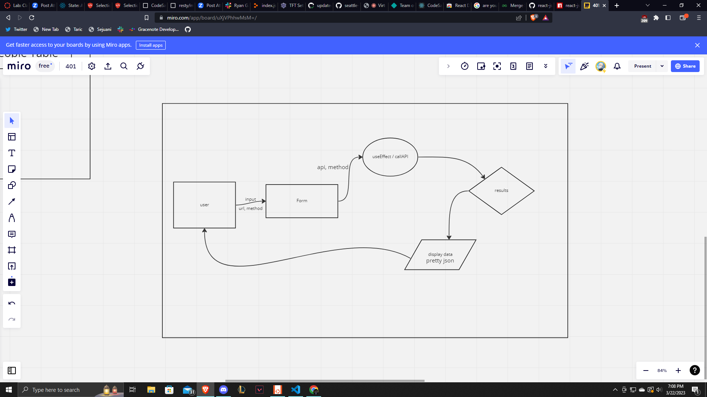

# LAB - Class 26, 27, 28 and 29

## Project: restY

### Author: Jonathan Staib

### Problem Domain

Using the server code create a react app changing class components to functional components, style with scss and deploy on sandbox. Added in some useState in functional components. Add in useEffect to await an axios url request, repond with pretty json. Add in url use history where the data can be accessed as well as create a reducer function.

### Links and Resources

- [Deployed Site](https://ye9cpf-3000.csb.app/)

- Ryan Gallaway
- react-pretty-json docs

### Setup

#### How to initialize/run your application (where applicable)

npm start

#### Features / Routes

only /get at the moment with the api url of your choice but I have only used pokemon, other CRUD functionalities will give a 404 error.

#### UML

